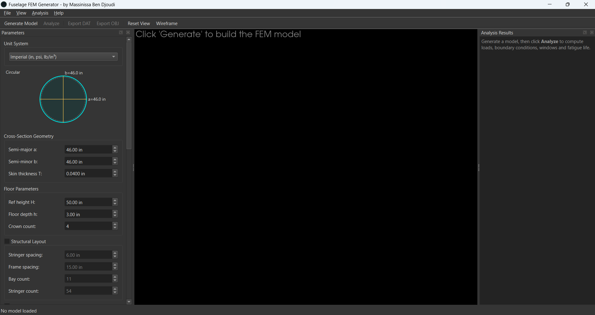
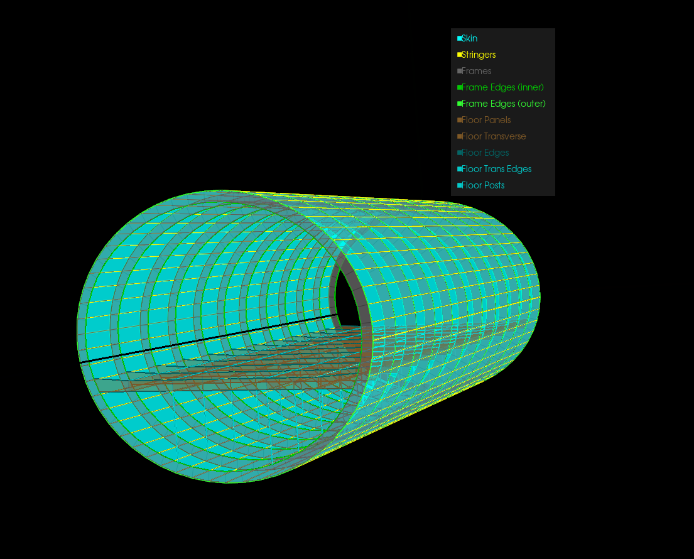

# Fuselage FEM Generator

Desktop application that builds a parametric finite element model of an aircraft fuselage
and exports it as a NASTRAN-ready `.dat` deck, without writing any code.

The tool grew out of my master's thesis, *Sensitivity Study of Fuselage Configurations under
Pressurization and Bending Effects* (USTHB, 2025), where the models were generated by a Python
script. The thesis closed on a recommendation: turn that script into a graphical interface so
engineers who do not program could use it. This repository is that interface.

**Author:** Massinissa Ben Djoudi

---

## What it does

- **Parametric geometry.** Elliptical cross-section with configurable semi-axes, skin thickness,
  longitudinal stringers, circumferential frames, floor beams and posts.
- **Window cutouts.** Placement by bay and stringer band, size, corner radius and reinforcement
  efficiency.
- **Interactive 3D view.** Colour-coded element groups, rotate, zoom, pan, wireframe toggle,
  per-group visibility and a colour legend.
- **Unit systems.** Switch between imperial (in, psi, lb/in³) and metric (mm, MPa, g/cm³); every
  field, label and range converts live. Internal storage stays imperial for NASTRAN compatibility.
- **Cross-section preview**, computed section properties and an element-count estimator.
- **Export.** `.dat` for MSC Nastran and Patran, `.obj` for CAD and rendering.
- **Presets.** Narrow-body, wide-body and regional-jet starting points, plus custom presets
  saved as JSON.
- **Input validation** in real time, so an invalid model cannot be generated.

A default configuration produces a mesh of about 1 400 nodes and 3 500 elements
(CQUAD4 skin, CROD stringers, frames and floor structure).

## Screenshots


*Parameter panel, 3D viewport and element colour legend.*


*Wireframe view showing the stringer, frame and floor structure.*

## Requirements

- Python 3.11
- PySide6, PyVista, pyvistaqt, NumPy (see `requirements.txt`)
- A GPU or driver supporting OpenGL 3.2 or later, for the 3D view

## Installation

```bash
git clone https://github.com/<your-username>/fuselage-fem-generator.git
cd fuselage-fem-generator
python -m venv .venv
.venv\Scripts\activate          # Windows
# source .venv/bin/activate     # Linux, macOS
pip install -r requirements.txt
python main.py
```

## Usage

1. Set the parameters in the left panel: cross-section, floor, structure, materials, windows.
2. Press **Generate Model** (`Ctrl+G`) to build the mesh.
3. Rotate, zoom and toggle element groups in the 3D view.
4. Press **Export DAT** (`Ctrl+E`) for NASTRAN, or export to `.obj`.

| Shortcut | Action |
|---|---|
| `Ctrl+G` | Generate model |
| `Ctrl+E` | Export NASTRAN `.dat` |
| `Ctrl+N` | Reset to defaults |
| `Ctrl+O` / `Ctrl+S` | Open / save a preset |
| `W` | Toggle wireframe |

## Headless check

Build a model and print its statistics without opening a window:

```bash
python main.py --selftest
```

## Tests

```bash
python -m pytest tests -q
```

72 unit tests cover the configuration and its validation, the unit conversions, the NASTRAN
element cards, the geometry generator and the exporters.

## Project layout

| File | Role |
|---|---|
| `main.py` | Entry point and headless self-test |
| `main_window.py` | Main window, menus, toolbar, status bar |
| `input_panel.py` | Parameter panel, presets, unit switching |
| `config.py` | `FuselageConfig` dataclass and validation rules |
| `fuselage_generator.py` | Geometry and mesh generation |
| `nastran_elements.py` | NASTRAN card classes (MAT1, PSHELL, PROD, CQUAD4, CROD…) |
| `exporter.py` | `.dat` and `.obj` writers |
| `renderer.py`, `viewer_3d.py` | PyVista rendering and the Qt viewport |
| `units.py` | Imperial and metric conversions |
| `generation_worker.py` | Background thread so the interface stays responsive |

## Scope and limitations

- The generator produces a **global finite element model** (GFEM) intended for linear static
  analysis. It does not run the solve: it writes the deck for MSC Nastran.
- Geometry is limited to elliptical and circular sections with constant skin thickness per region.
- The models were checked against closed-form thin-wall theory during the thesis work
  (hoop and longitudinal stress under pressurisation, bending response).

## Licence

MIT. See `LICENSE`.
